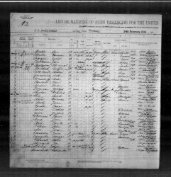
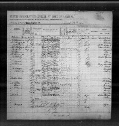
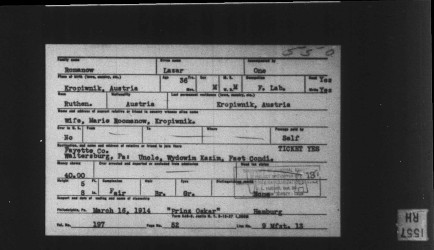
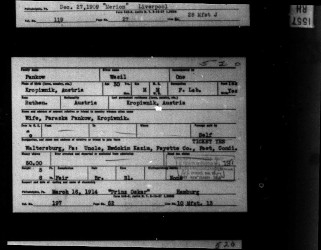

# Подорож до США #2 #

Список пасажирів корабля, 1914 (Pennsylvania, Philadelphia, Passenger Lists, 1883-1945, FamilySearch, Images 234-235, Lines 9-10)

Сторінка 1:

Сторінка 2:

Картка каталогу про пасажира Лазара Романів, створена на основі попереднього списку (Pennsylvania, Philadelphia, Passenger List Index Cards, 1883-1948, Database, FamilySearch, Image 3588):

Картка каталогу про пасажира Василя Паньків, створена на основі попереднього списку (Pennsylvania, Philadelphia, Passenger List Index Cards, 1883-1948, Database, FamilySearch, Image 3961)

# Опис #

Лазар Романів, дев'ятий рядок в списку пасажирів:

**Name (ім'я):** Lazar Romanow  
**Age (вік):** 36  
**Married (одружений):** Yes  
**Occupation (професія):** F. Lab. (farm laborer, cільськогосподарський працівник)  
**Able to read (вміє читати):** Yes  
**Able to write (вміє писати):** Yes  
**Nationality (громадянство):** Austria (Австро-Угорщина)  
**Race or People (національність):** Ruthenian (русин, назва українців в той час)  
**Last permanent residence (остання адреса проживання):** Austria, Kropiwnik (Австро-Угорщина, Кропивник)  
**Name and address of nearest relative (ім'я та адреса найближчого родича):** Wife Maria Romanow, Kropiwnik (дружина Марія Романів, Кропивник)  
**Final destination (пункт призначення):** Pennsylvania, Waltersburg (https://en.wikipedia.org/wiki/Waltersburg,_Pennsylvania)  
**Passage paid by (подорож оплачена):** Self (самостійно)  
**Has ever been in US before (чи був в США раніше):** No (так вказано, певно помилка)  
**Money shown (наявні гроші):** USD 40 (приблизно USD 1300 в цінах 2025 року)  
**Destination and name/address of relative to join in the US (пункт призначення та ім'я/адреса родича в США):** Uncle Ewdokim Kizim (?), Waltersburg, Fayette County, Pennsylvania (дядько, ймовірно Євдоким Кізім, в місті Волтерсбург, округ Фаєтт, штат Пенсільванія)  
**Height (висота):** 5 foot 8 inches (173 см)  
**Hair color (колір волосся):** Brown (коричневе)  
**Eye color (колір очей):** Grey (сірі)  
**Complexion (колір шкіри):** Fair (білошкірий)  
**Place of birth (місце народження):** Austria, Kropiwnik (Австро-Угорщина, Кропивник)  
**Name of the ship (назва корабля):** S.S. Prinz Oskar (https://en.wikipedia.org/wiki/SS_Prinz_Oskar)  
**Sailing from (місто, з якого пливе):** Hamburg 1914-02-28  
**Date of landing (дата прибуття в порт призначення):** Philadelphia 1914-03-16  

Василь Паньків, десятий рядок в списку пасажирів:

**Name (ім'я):** Wasil Pankow  
**Age (вік):** 30  
**Married (одружений):** так само  
**Occupation (професія):** так само  
**Able to read (вміє читати):** так само  
**Able to write (вміє писати):** так само  
**Nationality (громадянство):** так само  
**Race or People (національність):** так само  
**Last permanent residence (остання адреса проживання):** так само  
**Name and address of nearest relative (ім'я та адреса найближчого родича):** Wife Paraska Pankow, Kropiwnik (дружина Параска Паньків, Кропивник)  
**Final destination (пункт призначення):** так само  
**Passage paid by (подорож оплачена):** так само  
**Has ever been in US before (чи був в США раніше):** так само  
**Money shown (наявні гроші):** USD 50 (приблизно USD 1600 в цінах 2025 року)  
**Destination and name/address of relative to join in the US (пункт призначення та ім'я/адреса родича в США):** так само  
**Height (висота):** так само  
**Hair color (колір волосся):** так само  
**Eye color (колір очей):** Blue (сині)  
**Complexion (колір шкіри):** так само  
**Place of birth (місце народження):** так само  
**Name of the ship (назва корабля):** так само  
**Sailing from (місто, з якого пливе):** так само  
**Date of landing (дата прибуття в порт призначення):** так само  
