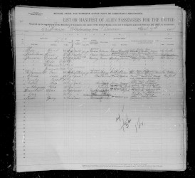
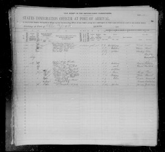

# Подорож до США (Орест Папп) #

Список пасажирів корабля, 1908 (New York, Passenger Arrival Lists (Ellis Island), 1892-1925, FamilySearch, Images 118-119, Line 1):

Сторінка 1:

Сторінка 2:

# Опис #

Орест Папп, перший рядок в списку пасажирів:

**Name (ім'я):** Orest Papp  
**Age (вік):** 42  
**Married (одружений):** Yes  
**Occupation (професія):** Pastor (cвященник)  
**Able to read (вміє читати):** Yes  
**Able to write (вміє писати):** Yes  
**Nationality (громадянство):** Austria, Galicia (Австро-Угорщина, Галичина)  
**Race or People (національність):** Ruthenian (русин, назва українців в той час)  
**Last permanent residence (остання адреса проживання):** Galicia, Nowosiolki (Галичина, Новосілки)  
**Name and address of nearest relative (ім'я та адреса найближчого родича):** Wife Zofia Papp, Nowosiolki/Husakow, Galicia (дружина Софія Папп, Новосілки/Гусаків, Галичина)  
**Final destination (пункт призначення):** New York (Нью-Йорк)  
**Has ever been in US before (чи був в США раніше):** No  
**Passage paid by (подорож оплачена):** Self (самостійно)  
**Money shown (наявні гроші):** USD 14 або USD 80 (приблизно USD 500 або USD 2600 в цінах 2025 року)  
**Destination and name/address of relative to join in the US (пункт призначення та ім'я/адреса родича в США):** Friend Bichof Peter Ortynski (?), Pennsylvania, Philadelphia, 63 (?), #1105 (друг, ймовірно єпископ [Сотер Ортинський](https://uk.wikipedia.org/wiki/Сотер_(Ортинський)), в місті Філадельфія, штат Пенсильванія)  
**Height (висота):** 5 foot 6 inches (168 см)  
**Hair color (колір волосся):** Light (світле)  
**Eye color (колір очей):** Gray (сірі)  
**Complexion (колір шкіри):** Fair (білошкірий)  
**Place of birth (місце народження):** Galicia, Brzeziec (Галичина, Березець)  
**Name of the ship (назва корабля):** S.S. Kronprinz Wilhelm (https://en.wikipedia.org/wiki/SS_Kronprinz_Wilhelm)  
**Sailing from (місто, з якого пливе):** Bremen 1908-04-07  
**Date of landing (дата прибуття в порт призначення):** New York 1908-04-15  
