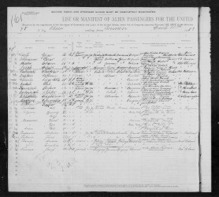
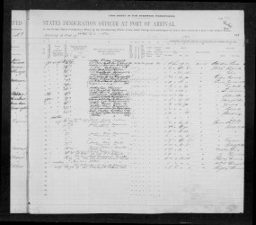
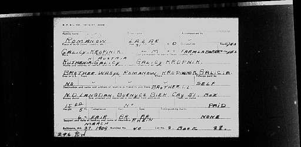

# Подорож #1 #

Список пасажирів корабля, 1909 (Maryland, Baltimore Passenger Lists, 1820-1948, FamilySearch, Images 1249-1250, Line 2):

Сторінка 1:

Сторінка 2:

Картка каталогу про пасажира Лазара Романів, створена на основі попереднього списку (Maryland, Baltimore Passenger Lists Index, 1897-1952, Database, FamilySearch, Image 12782):

# Опис #

Лазар Романів, другий рядок в списку пасажирів:

**Name (ім'я):** Lazar Romanow  
**Age (вік):** 31  
**Married (одружений):** Yes  
**Occupation (професія):** Farm laborer (cільськогосподарський працівник)  
**Able to read (вміє читати):** Yes  
**Able to write (вміє писати):** Yes  
**Nationality (громадянство):** Austria, Galicy (Австро-Угорщина, Галичина)  
**Race or People (національність):** Ruthenian (русин, назва українців в той час)  
**Last permanent residence (остання адреса проживання):** Galicy, Kropiwnik (Галичина, Кропивник)  
**Name and address of nearest relative (ім'я та адреса найближчого родича):** Brother Wasyl Romanow, Kropiwnik, Galicy (брат Василь Романів, Кропивник, Галичина)  
**Final destination (пункт призначення):** North Dakota, Langdan (https://en.wikipedia.org/wiki/Langdon,_North_Dakota)  
**Has ever been in US before (чи був в США раніше):** No  
**Passage paid by (подорож оплачена):** Self (самостійно)  
**Money shown (наявні гроші):** USD 15 (приблизно USD 500 в цінах 2025 року)  
**Destination and name/address of relative to join in the US (пункт призначення та ім'я/адреса родича в США):** Brother-in-law Barnych (?), Biek Way (?), 51 Box, Langdan, North Dakota (чоловік дружини, ймовірно Барнич, в місті Лангдан, штат Північна Дакота)  
**Height (висота):** 5 foot 6 inches (168 см)  
**Hair color (колір волосся):** Brown (коричневе)  
**Eye color (колір очей):** Brown (коричневі)  
**Complexion (колір шкіри):** Fair (білошкірий)  
**Place of birth (місце народження):** Galicy, Kropiwnik (Галичина, Кропивник)  
**Name of the ship (назва корабля):** S.S. Rhein (https://en.wikipedia.org/wiki/USS_Susquehanna_(ID-3016))  
**Sailing from (місто, з якого пливе):** Bremen 1909-03-11  
**Date of landing (дата прибуття в порт призначення):** Baltimore 1909-03-27  
