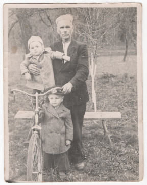
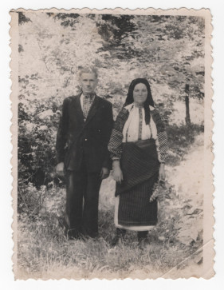
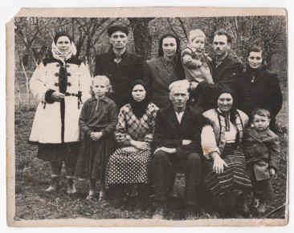
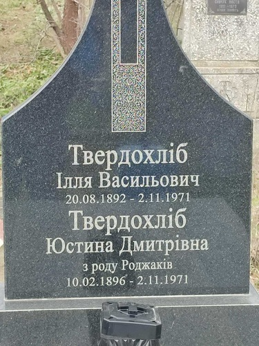

# Ілля Твердохліб #

Повне ім'я при народженні - Ілля Твердохліб, після Другої світової війни - Твердохліб Ілля Васильович. Варіанти імені в документах:

- Ілія Твердохліб
- Ілия Твердохліб

Народився 1892-08-20 або 1899-07-31 в селі [Устя](https://uk.wikipedia.org/wiki/Устя_(Чортківський_район)), помер 1971-11-02 там же (у віці 72 або 79 років). Могила знаходиться в Усті.

Батьки - [Василь Твердохліб](Василь%20Твердохліб%20(1855).md) та [Параска Фостій](Параска%20Фостій.md) (жили в будинку #74).

## Фото ##

## Освіта та робота ##

В основному працював на землі (рільник), частину часу підробляв сторожем.

## Шлюб та діти ##

1922-11-14 одружився з [Юстиною Роґа](Юстина%20Роґа.md). Мали троє дітей (інформація на сторінці дружини).

## Інша інформація ##

Жив в будинку #74.

Дата народження вказана в повторному свідоцтві про народження (1892-08-20) і в записі про шлюб (1899-07-31). Записи про народження в метричній книзі Устя за 1892 і 1899 роки не збереглися, але 1899 рік значно більш ймовірний:

- запис про шлюб був зроблений на 30 років раніше від дати видачі повторного свідоцтва про народження
- запис про шлюб був зроблений священником, який там працював протягом 30 років (Ізидор Ганкевич, 1892 - 1936)
- цей священник мав би мати доступ до оригінальної метричної книги з записами про народження, яка зберігалася в церкві
- більше того, це був той самий священник, який мав би робити початковий запис про народження (або його помічник)

На час видачі повторного свідоцтва йому якраз "виповнилося" 60 років, можливо інша дата народження пов'язана з пенсійним віком або необхідністю працювати в колгоспі до певного віку.

Причина смерті - нещасний випадок (завалився дах будинку через пожежу коло комина).

## Джерела інформації ##

- Спогади Лева Твердохліба записані в 2024 році (мій тато, його внук)
- [Фото свідоцтва про народження](https://drive.google.com/file/d/1s9a6n3yxA2Lgk9QWhzpLVz6WwM0DCA6k/view) (відновлене, видане в 1952 році)

## Уточнити та додати ##

- Витяг з реєстру актів цивільного стану (смерть)
