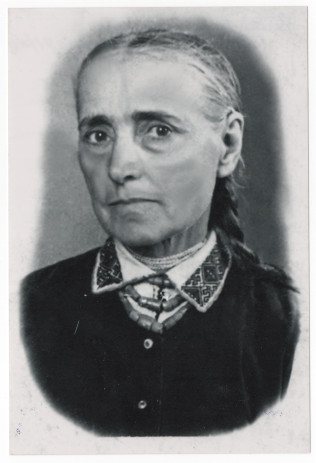

# Анастасія Бреславська #

Повне ім'я при народженні - Анастасія Бреславська, після Другої світової війни - Бреславська Анастасія Федорівна. Варіанти імені в документах - Anastasia Breslawska (лат.).

Народилася 1881-12-06 в селі Кропивник, померла в 1972 році там же (у віці 91 року). Могила знаходиться в Кропивнику.

Батьки - [Федір Бреславський](Федір%20Бреславський.md) та [Анастасія Яців](Анастасія%20Яців.md) (жили в будинку #137).

## Фото ##

## Освіта та робота ##

Працювала на полі (lat. agricola).

## Шлюб та діти ##

1906-02-11 одружилася з Миколою Бреславським. Мали п'ятеро дітей:

- Анна (1907-01-17)
- Федір (1908-09-26 - 1947-02-07). [Фото 17](../photos/photo_017.md)
- Марта (1910-03-06)
- Дівчинка, померла при народженні (1911-09-10)
- Анастасія (1913-07-13 - 1914-08-20)

Перший чоловік помер на Першій світовій війні, 1921-06-21 одружилася вдруге з його братом, [Йосипом Бреславським](Йосип%20Бреславський.md). Мали троє дітей:

- Марія (1922-03-03 - 1956).
- [Василь](Василь%20Бреславський.md) (1924-04-11 - 2001-03-17).
- Микола (1928-08-06 - 1970). [Фото 15](../photos/photo_015.md).

## Інша інформація ##

До одруження жила в будинку батьків #137, після одруження - в будинку чоловіка #24.

Син Федір Бреславський був засуджений на 15 років за участь в УПА, помер у Воркуті:

> БРЕСЛАВСЬКИЙ Федір Миколайович, 1905 р. н., с. Кропивник Калуського району, українець, освіта початкова. Проживав нелегально. Заарештований 26.03.1945. Звинувачення: вояк УПА (боївка Галайди), псевдо - Кріпкий. Військовим трибуналом військ НКВС Станіславської області 12.09.1945 засуджений на 15 років каторжних робіт і 5 років пораження в правах із конфіскацією майна. Реабілітований 17.08.1993. (13190 П).

Точний рік народження Федора невідомий, в справі вказаний 1905, але його батьки одружилися в 1906 році і запис про його (?) народження існує тільки в 1908 році.

Син Микола Бреславський покінчив життя самогубством через переслідування радянської влади за його проукраїнську позицію.

## Джерела інформації ##

- Спогади Марії Бреславської записані в 2024 році (моя мама, її внучка)
- [Метрична книга церкви c. Кропивник (копія), реєстрація народження, 1866-1939](https://drive.google.com/drive/folders/18U3PZbOdTgMM1U5Iw7UTo_8A_ZYruVRu) (ДАІФО, фонд 631, опис 9, справа 18)
  - запис про народження (скан 95)
  - запис про народження дочки Анни (скан 225)
  - запис про народження сина Федора (скан 232)
  - запис про народження дочки Марти (скан 240)
  - запис про народження дочки, яка померла при народженні (скан 247)
  - запис про народження дочки Анастасії (скан 257)
  - запис про народження дочки Марії (скан 304)
  - запис про народження сина Василя (скан 314)
  - запис про народження сина Миколи (скан 343)
- [Метрична книга церкви c. Кропивник (копія), реєстрація шлюбу та смерті, 1866-1939](https://drive.google.com/drive/folders/1ZtwtLB6Q08sQZLRjRFx5xmgFab1oSc5z) (ДАІФО, фонд 631, опис 9, справа 19)
  - запис про шлюб #1 (скан 252)
  - запис про смерть дочки, яка померла при народженні (скан 274)
  - запис про смерть дочки Анастасії (скан 294)
  - запис про шлюб #2 (скан 331)
- [Реабілітовані історією. Івано-Франківська область. Книга 1 - 2004](https://www.reabit.org.ua/files/store/Ivano-Frankivsk_1.pdf)
  - запис про Федора Бреславського (с. 425)
- [Справа 13191-П (Федір Бреславський, Василь Коневич) (перефотографована 2025-11-05)](https://drive.google.com/drive/folders/1zgkjxta9joIved7T0y1xvzHWPbBd_EsG)

## Уточнити та додати ##

- витяг з реєстру актів цивільного стану (смерть)
- фото могили
