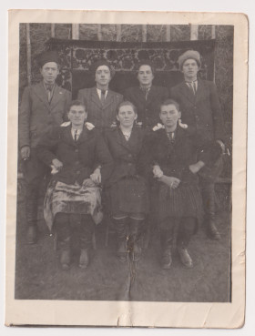
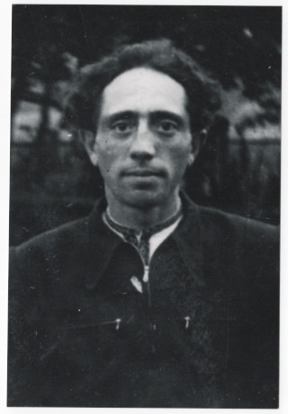

# Василь Бреславський #

Повне ім'я при народженні: Василь Йосипович Бреславський.

Народився в 1924 році в селі Кропивник, помер в 2001 році там же (у віці 75 років). Могила знаходиться в Кропивнику.

## Фото ##

## Освіта ##

Школа (4-7 класів), іншої формальної освіти не мав (вчився під час роботи, на практиці).

## Робота ##

Більшість життя працював будівельником/столяром, робив черепицю, опалубки для бетону. Декілька років працював сторожем.

## Шлюб та діти ##

В листопаді 1948 року одружився з [Мартою Булавинець](Марта%20Булавинець.md). Мали двоє дітей (інформація на сторінці дружини).

## Інша інформація ##

В Кропивнику в той час жив ще інший Бреславський Василь Йосипович (1927 року народження), батька якого також звали Бреславський Йосип Васильович (1891 року народження). Незважаючи на це, вони до "наших" Бреславських прямого відношення не мають, хіба далекі родичі. Інший Василь був вояком УПА і був засуджений на 15 років таборів (згаданий в книзі Реабілітовані історією. Івано-Франківська область. Книга 1 - 2004, с. 427):

Бреславський Василь Йосипович, 1927 р. н., с. Кропивник Калуського району, українець, освіта початкова. Проживав нелегально. Заарештований 18.03.1945. Звинувачення: вояк УПА (сотня Ґонти, 1945), псевдо - Явір. Військовим трибуналом військ МВС Станіславської області 12.09.1945 засуджений на 15 років позбавлення волі та 5 років пораження в правах із конфіскацією майна. Реабілітований 06.08.1991. (5628-П).

Відбув 11.5 років, повернувся в Кропивник. Матеріали справи 5628-П перефотографовані 2025-09-15: https://drive.google.com/drive/folders/1_O2QV8U6GmG6_z_aMmtU5SX_1WnY5-jf

## Причина смерті ##

Курив все життя, деменція приблизно 1-2 роки перед смертю (стан потрохи погіршувався, на час смерті більшість часу лежав). Гіпертонії не мав.

## Джерела інформації та документи ##

Більшість інформації записано в 2024 році зі слів його дочки Марії (моєї мами).

## Уточнити та додати ##

- точні дати народження, шлюбу та смерті (+джерела)
- витяги з реєстру актів цивільного стану
- скани свідоцтва про народження та/або паспорта (якщо збереглися)
- фото особи та могили
