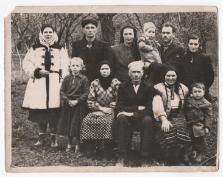

# Василь Твердохліб #

Повне ім'я при народженні - Василь Твердохліб, після Другої світової війни - Твердохліб Василь Ілліч.

Народився 1928-06-01 в селі [Устя](https://uk.wikipedia.org/wiki/Устя_(Чортківський_район)), помер 2006-06-12 в селі [Мельниця-Подільська](https://uk.wikipedia.org/wiki/Мельниця-Подільська) (у віці 78 років). Могила знаходиться в Усті.

Батьки - [Ілля Твердохліб](Ілля%20Твердохліб.md) та [Юстина Роджак](Юстина%20Роджак.md).

## Фото ##

## Освіта та робота ##

Вчився в Львівському ветеринарному інституті на ветлікаря (випуск 1953 року). Працював ветеринаром в різних районах Тернопільської і Чернівецької областей.

Наприкінці 1980-х років розпочав активну політичну діяльність, був членом Руху. В 1990-х роках працював сільським головою в Мельниці-Подільській (один строк).

## Шлюб та діти ##

Одружився з [Дарією Чайківською](Дарія%20Чайківська.md) (церковний шлюб в 1956 році, шлюб в РАЦСі 1978-07-02). Мали четверо дітей (інформація на сторінці дружини).

## Інша інформація ##

Метрична книга Устя за 1928 рік збереглася, ДАТО мав би її відсканувати до кінця року.

Причина смерті - рак простати (за 5-10 років до того мав операцію по її видаленню).

## Джерела інформації ##

- Спогади Лева Твердохліба записані в 2024 році (мій тато, його син)
- [Фото випускного альбому з інституту](https://drive.google.com/file/d/1vht2mWs04oe577T-zGy-dhelDNn7M_Ro/view)

## Уточнити та додати ##

- Запис про народження
- Витяг з реєстру актів цивільного стану або свідоцтво (смерть)
