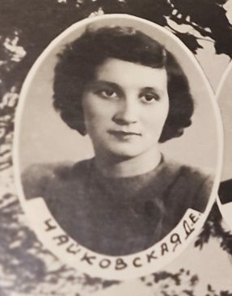
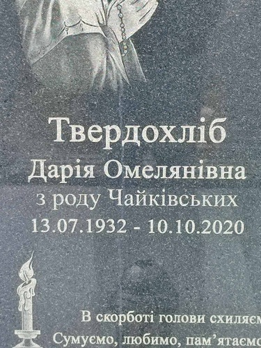

# Дарія Чайківська #

Повне ім'я при народженні - Дарія Чайківська, після Другої світової війни - Чайківська Дарія Омелянівна, після одруження - Твердохліб Дарія Омелянівна.

Народилася 1932-07-13 в селі [Яблінки](https://uk.wikipedia.org/wiki/Яблінки), померла 2020-10-10 в селі Мельниця-Подільська (у віці 88 років). Могила знаходиться в Усті.

Батьки - [Омелян Чайківський](Омелян%20Чайківський.md) та [Олена Папп](Олена%20Папп.md) (жили в будинку #10).

## Фото ##

## Освіта та робота ##

Вчилася в Львівському нафтопромисловому технікумі на техніка-механіка (1952 - 1955)

Після технікуму була направлена працювати на нафтову вишку десь в Центральній Азії (можливо в Татарстан).
Потім працювала на Львівському заводі газової апаратури. Порядок навчання і роботи точно не відомий, може бути трохи інший.

Після одруження певний час працювала в колгоспі, потім займалась домашнім господарством.

## Шлюб та діти ##

Одружилася з [Василем Твердохлібом](Василь%20Твердохліб.md) (церковний шлюб в 1956 році, шлюб в РАЦСі 1978-07-02). Мали четверо дітей:

- Лев (1957-05-11 - живе). [Фото 1](../photos/photo_001.md), [Фото 10](../photos/photo_010.md), [Фото 12](../photos/photo_012.md)
- Петро (1959-07-12 - живе). [Фото 1](../photos/photo_001.md), [Фото 10](../photos/photo_010.md), [Фото 12](../photos/photo_012.md), [Фото 40](../photos/photo_040.md)
- Галина (1962-10-28 - живе)
- Юстина (1972-08-15 - живе)

## Інша інформація ##

Метрична книга Яблінок за 1920-1930 роки збереглася, але зараз перебуває в USC в Балигороді (аналог українського відділу РАЦСу) і має відповідний порядок доступу (=складний). До архіву буде передана через 100 років з часу останнього запису, ближче до другої половини 2030-х років. Так що запис про народження Дарії буде реально отримати тільки тоді.

Під час Другої світової війни була поранена в ногу. В 1946 році була депортована разом з батьками з Польщі (село Рябе) в Україну (село Мельниця-Подільська).

Їздила в Грузію (лікування/відновлення після емоційного виснаження), село [Ціхісдзірі](https://en.wikipedia.org/wiki/Tsikhisdziri,_Kobuleti_Municipality) на узбережжі Чорного моря. Протягом життя декілька разів відвідувала сестру та інших родичів в Польщі.

Причина смерті - старість, деменція декілька років перед смертю. Мала гіпертонію.

## Джерела інформації ##

- Спогади Лева Твердохліба записані в 2024 році (мій тато, її син)
- Витяг з реєстру актів цивільного стану ([шлюб](https://drive.google.com/file/d/1B5y4Y6yH6phRCIMjXmj5qn0aMx_PG_rr/view))
- [Фото випускного альбому з технікуму](https://drive.google.com/file/d/1YZU8AonCF__y6RCePk1Zy-j7F-jAcmgU/view)
- Владислав Сердюк - Династії галицьких священиків Чайківських і Паппів - 2016

## Уточнити та додати ##

- Запис про народження
- Витяг з реєстру актів цивільного стану або свідоцтво (смерть)
