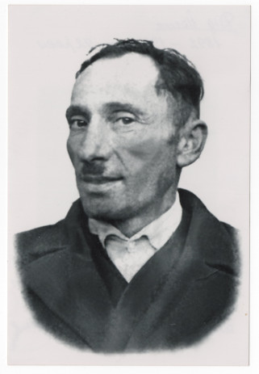

# Йосип Бреславський #

Повне ім'я при народженні - Йосип Бреславський, після Другої світової війни - Бреславський Йосип Васильович. Варіанти імені в документах:

- Josephus Breslawski (лат.)
- Йосиф Бреславский

Народився 1893-04-14 в селі Кропивник, помер в 1984 році там же (у віці 91 року). Могила знаходиться в Кропивнику.

Батьки - [Василь Бреславський](Василь%20Бреславський%20(1854).md) та [Марія Шинкар](Марія%20Шинкар.md) (жили в будинку #24).

## Фото ##

## Освіта та робота ##

Працював на полі (lat. agricola).

## Шлюб та діти ##

1921-06-21 одружився з [Анастасією Бреславською](Анастасія%20Бреславська.md). Мали троє дітей (інформація на сторінці дружини).

## Інша інформація ##

Жив в будинку #24.

Був з багатших селян, один час був війтом. Після Другої світової війни радянська влада забрала більшість майна ("розкуркулили") і прийняла рішення про виселення за межі України. На практиці справа до виселення не дійшла - перші роки Йосип переховувався, потім, судячи з всього, настало невелике "потепління", мова про виселення вже не йшла, обмежилися конфіскацією майна і податками.

## Джерела інформації ##

- Спогади Марії Бреславської записані в 2024 році (моя мама, його внучка)
- [Метрична книга церкви c. Кропивник (копія), реєстрація народження, 1866-1939](https://drive.google.com/drive/folders/18U3PZbOdTgMM1U5Iw7UTo_8A_ZYruVRu) (ДАІФО, фонд 631, опис 9, справа 18)
  - запис про народження (скан 160)
- [Списки куркульських господарств Калуського району. 1950 рік](https://drive.google.com/drive/folders/1H3Xm_aRBplb3qx4Guaq5TR7KxXzXVuQ4) (ДАІФО, фонд Р-1559, опис 2, справа 22a)
  - документи про Йосипа Бреславського (скани 88-100)

## Уточнити та додати ##

- витяг з реєстру актів цивільного стану (смерть)
- фото могили
