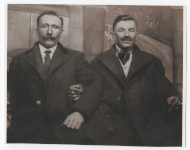

# Лазар Романів #

Повне ім'я при народженні - Лазар Романів, на час смерті - Романів Лазар Ількович. Варіанти імені в документах:

- Lazarus Romanow (lat.)
- Lazar Romanow (eng.)

Народився в 1878 році в Кропивнику, помер 1941-10-03 там же (у віці 63 років). Могила знаходиться в Кропивнику.

Батьки - Ілля Романів та Марина Бреславська (жили в будинку #20).

## Фото ##

## Освіта та робота ##

Працював на полі (lat. agricola, eng. farm laborer).

Два рази був в США (працював). Перший раз сам (1909), другий раз з Василем Паньків з Кропивника (1914).

Другий раз їх там застала Перша світова війна, так що поверталися пізніше.

В обох випадках збереглись списки пасажирів корабля з детальною інформацією про них (див. нижче).

## Шлюб та діти ##

1903-11-19 одружився з [Марією Паньків](Марія%20Паньків.md). Мали одну дитину (інформація на сторінці дружини).

## Інша інформація ##

До одруження і поїздки в США жив в будинку батьків #20, після - в будинку #272.

Запис про народження в копії метричної книги відсутній, є тільки записи про шлюб і народження доньки. Щонайменше в трьох записах (одруження і дві подорожі в США) вказана дата запису і його вік. Якщо вірити їм, то можна розрахувати приблизний період народження - з 1877-11-19 по 1878-03-16.

Інформація про батьків Лазара вказана в записах про шлюб і народження доньки.

В США заробив багато грошей (по українських мірках того часу), купив багато поля в Кропивнику.

Ми (мама і баба) спочатку не знали, хто саме був той другий чоловік на фото, з яким Лазар подорожував до США (Лазар помер коли баба ще була тінейджеркою). Пам'ятали тільки, що це "тато Марці Василькової", Лазарів друг та/або родич. Потім, коли знайшли списки пасажирів, з'ясувалося, що це був Василь Паньків (приблизно 1884 року народження). І ще пізніше, коли знайшли точне ім'я дружини Лазара в метричній книзі та імена її братів і сестер, дізналися, що це був старший брат дружини (народився 1884-02-11).

Радянська влада наприкінці життя (1939-1941) забрали більшість майна, Лазар переніс інсульт і помер у відносно ранньому віці.

## Джерела інформації ##

- Спогади Марії Бреславської записані в 2024 році (моя мама, його правнучка)
- [подорож до США #1 (1909 рік, Лазар Романів)](../docs/doc_001.md)
- [подорож до США #2 (1914 рік, Лазар Романів і Василь Паньків)](../docs/doc_002.md)

## Уточнити та додати ##

- точну дату народження
- фото могили
