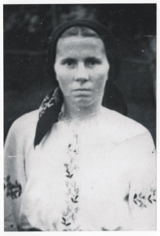
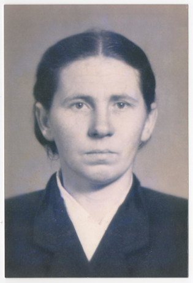
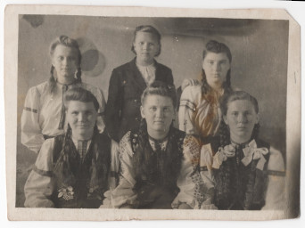

# Марта Булавинець #

Повне ім'я при народженні: Марта Миколаївна Булавинець.

Народилася в 1927 році в селі Кропивник, померла в 2017 році там же (у віці 90 років). Могила знаходиться в Кропивнику.

## Фото ##

## Освіта ##

Школа (4-7 класів), навчання в кравчині (разом з сестрою Анною).

## Робота ##

Більшість життя працювала в місцевому колгоспі.

## Шлюб та діти ##

В листопаді 1948 року вийшла заміж за [Василя Бреславського](Василь%20Бреславський.md), змінила прізвище на "Бреславська". Мали двоє дітей:

- Микола (1950 - живе)
- Марія (1958-07-22 - живе)

## Інша інформація ##

TBA

## Причина смерті ##

Старість (з явних хвороб мала тільки гіпертонію, приймала таблетки від тиску). Мала гарну пам'ять аж до самої смерті.

## Джерела інформації та документи ##

Більшість інформації записано в 2024 році зі слів її дочки Марії (моєї мами). День народження мами я пам'ятаю сам.

## Уточнити та додати ##

- точні дати народження, шлюбу та смерті (+джерела)
- точні дати народження дітей (+джерела)
- коротку інформацію про дітей
- витяги з реєстру актів цивільного стану
- скани свідоцтва про народження та/або паспорта (якщо збереглися)
- фото особи та могили
