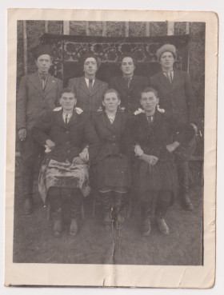

# Марта Булавинець #

Повне ім'я при народженні: Марта Булавинець, після Другої світової війни та одруження - Бреславська Марта Миколаївна. Варіанти імені в документах - Martha Bulavynets (лат.).

Народилася 1927-07-13 в селі Кропивник, померла 2017-06-24 там же (у віці 89 років). Могила знаходиться в Кропивнику.

Батьки - [Микола Булавинець](Микола%20Булавинець.md) та [Марія Романів](Марія%20Романів.md) (жили в будинку #272).

## Фото ##

## Освіта та робота ##

Початкова школа, навчання в кравчині (разом з сестрою Анною).

Більшість життя працювала в місцевому колгоспі.

## Шлюб та діти ##

В листопаді 1948 року вийшла заміж за [Василя Бреславського](Василь%20Бреславський.md). Мали двоє дітей:

- Микола (1950 - живе)
- Марія (1958-07-22 - живе)

## Інша інформація ##

Причина смерті - старість (з явних хвороб мала тільки гіпертонію, приймала таблетки від тиску). Мала гарну пам'ять аж до самої смерті.

## Джерела інформації ##

- Спогади Марії Бреславської записані в 2024 році (моя мама, її дочка)
- [Метрична книга церкви c. Кропивник (копія), реєстрація народження, 1866-1939](https://drive.google.com/drive/folders/18U3PZbOdTgMM1U5Iw7UTo_8A_ZYruVRu) (ДАІФО, фонд 631, опис 9, справа 18)
  - запис про народження (скан 336)

## Уточнити та додати ##

- витяг з реєстру актів цивільного стану або свідоцтво (шлюб, смерть)
- фото могили
