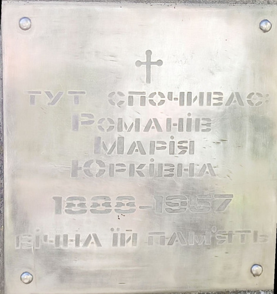

# Марія Паньків #

Повне ім'я при народженні - Марія Паньків, після одруження - Марія Романів, після Другої світової війни - Романів Марія Юрківна. Варіанти імені в документах:

- Maria Pankow (lat.)
- Maria Pankiw (lat.).

Народилася 1887-01-11 в селі Кропивник, померла в 1957 році там же (у віці 70 років). Могила знаходиться в Кропивнику.

Батьки - Юрій Паньків та Юлія Барнич (жили в будинку #14).

# Фото #

# Освіта та робота #

Працювала на полі (lat. agricola).

# Шлюб та діти #

1903-11-19 одружилася з [Лазарем Романів](Лазар%20Романів.md), мали 1 дитину:
- [Марія](Марія%20Романів.md) (1906-02-19 - 1999).

# Інша інформація #

До одруження жила в будинку батьків #14, після одруження - в будинку чоловіка #20 або 272.

На відновленій могилі вказано, що вона народилася в 1888 році. В записі про одруження вказано, що їй 17 років, що відповідає періоду народження з 1885-11-19 по 1886-11-19. В будинку #14 протягом 1880-х років народилося декілька Марій:

- перша народилася 1883-04-04 і померла 1883-04-20 (батьки - Юрій Паньків та Юлія Барнич)
- друга народилася 1887-01-11 (батьки - Юрій Паньків та Юлія Барнич)
- третя народилася 1888-07-08 (батьки - Федір Урус та Анна Мельник).

Схоже на те, що справжня дата народження "нашої" Марії - 1887-01-11, в записі про шлюб їй "додали"" декілька місяців, щоб було 17 років (церква негативно ставилася до ранніх шлюбів), на відновленій могилі рік народження помилковий. Трохи більше інформації буде коли отримаємо запис про смерть, але відділ РАЦСу в 1957 році не мав інших документів на час складення запису, в кращому випадку ту ж копію метричної книги, в гіршому випадку - просто слова заявника.

# Джерела інформації #

- Спогади Марії Бреславської записані в 2024 році (моя мама, її правнучка)
- [Метрична книга церкви c. Кропивник (копія), реєстрація народження, 1866-1939](https://drive.google.com/drive/folders/18U3PZbOdTgMM1U5Iw7UTo_8A_ZYruVRu) (ДАІФО, фонд 631, опис 9, справа 18)
  - запис про народження (скан 129)
  - запис про народження дочки Марії (скан 221)
- [Метрична книга церкви c. Кропивник (копія), реєстрація шлюбу та смерті, 1866-1939](https://drive.google.com/drive/folders/1ZtwtLB6Q08sQZLRjRFx5xmgFab1oSc5z) (ДАІФО, фонд 631, опис 9, справа 19)
  - запис про шлюб (скан 231)

# Уточнити та додати #

- витяг з реєстру актів цивільного стану (смерть)
