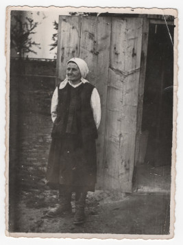

# Марія Романів #

Повне ім'я при народженні - Марія Романів, після одруження - Марія Булавинець, після Другої світової війни - Булавинець Марія Лазарівна. Варіанти імені в документах - Maria Romaniv (лат.).

Народилася 1906-02-19 році в селі Кропивник, померла в 1999 році там же (у віці 92 років). Могила знаходиться в Кропивнику.

Батьки - [Лазар Романів](Лазар%20Романів.md) та [Марія Паньків](Марія%20Паньків.md) (жили в будинку #20 або #272).

## Фото ##

## Освіта та робота ##

Працювала на полі, рільник (lat. agricola).

## Шлюб та діти ##

1925-02-19 одружилася з [Миколою Булавинцем](Микола%20Булавинець.md). Мали п'ять дітей:

- Степан (1925-12-15 - 1926-07-21)
- [Марта](Марта%20Булавинець.md) (1927-07-13 - 2017-06-24)
- Анна (1932-08-20 - 2021). [Фото 24](../photos/photo_024.md), [Фото 25](../photos/photo_025.md), [Фото 26](../photos/photo_026.md), [Фото 28](../photos/photo_028.md), [Фото 39](../photos/photo_039.md)
- Ярослав (1938-01-03)
- Микола (1945 - 2021). [Фото 39](../photos/photo_039.md)

## Інша інформація ##

До одруження жила в будинку батьків (#20 або #272), після одруження - в будинку #272.

Двоє дітей померли в дитячому віці (Степан і Ярослав).

Причина смерті - падіння з висоти та/або утоплення.

## Джерела інформації та документи ##

- Спогади Марії Бреславської записані в 2024 році (моя мама, її внучка)
- [Метрична книга церкви c. Кропивник (копія), реєстрація народження, 1866-1939](https://drive.google.com/drive/folders/18U3PZbOdTgMM1U5Iw7UTo_8A_ZYruVRu) (ДАІФО, фонд 631, опис 9, справа 18)
  - запис про народження (скан 221)
  - запис про народження сина Степана (скан 327)
  - запис про народження дочки Марти (скан 336)
  - запис про народження дочки Анни (скан 365)
  - запис про народження сина Ярослава (скан 401)
- [Метрична книга церкви c. Кропивник (копія), реєстрація шлюбу та смерті, 1866-1939](https://drive.google.com/drive/folders/1ZtwtLB6Q08sQZLRjRFx5xmgFab1oSc5z) (ДАІФО, фонд 631, опис 9, справа 19)
  - запис про шлюб (скан 355)
  - запис про смерть сина Степана (скан 366)

## Уточнити та додати ##

- витяг з реєстру актів цивільного стану (смерть)
- фото могили
