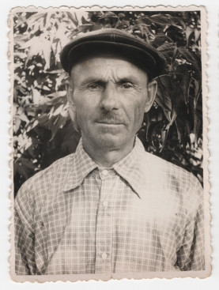

# Микола Булавинець #

Повне ім'я при народженні - Микола Булавинець, після Другої світової війни - Булавинець Микола Прокопович. Варіанти імені в документах:

- Николай Булавинець
- Nicolaus Bulawynec (лат.)
- Nicolaus Bulavynets (лат.)

Народився 1903-02-05 в селі Кропивник, помер в червні 1983 року там же (у віці 80 років). Могила знаходиться в Кропивнику.

Батьки - Прокіп Булавинець та Анна Головків (жили в будинку #12).

## Фото ##

## Освіта та робота ##

Працював на полі, рільник (lat. agricola), потім в колгоспі.

## Шлюб та діти ##

1925-02-19 одружився з [Марією Романів](Марія%20Романів.md). Мали п'ятеро дітей (інформація на сторінці дружини).

## Інша інформація ##

До одруження жив в будинку батьків #12, після одруження - в будинку дружини #272.

Причина смерті - інсульт, перед смертю певний час був паралізований.

## Джерела інформації та документи ##

- Спогади Марії Бреславської записані в 2024 році (моя мама, його внучка)
- [Метрична книга церкви c. Кропивник (копія), реєстрація народження, 1866-1939](https://drive.google.com/drive/folders/18U3PZbOdTgMM1U5Iw7UTo_8A_ZYruVRu) (ДАІФО, фонд 631, опис 9, справа 18)
  - запис про народження (скан 206)

## Уточнити та додати ##

- витяг з реєстру актів цивільного стану (смерть)
- фото могили
