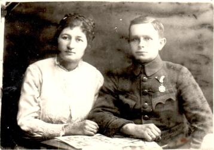
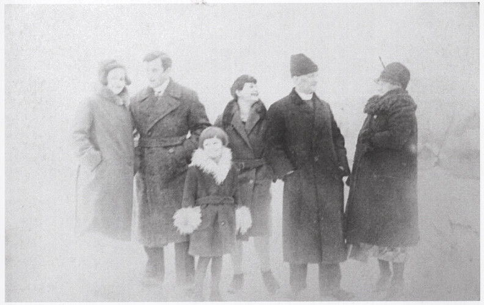

# Олена Папп #

Повне ім'я при народженні - Олена Папп, після одруження - Олена Чайківська, після Другої світової війни - Чайківська Олена Орестівна.

Народилася 1896-01-02 в селі [Твіржа](https://uk.wikipedia.org/wiki/Твіржа) (пол. Twierdza), померла 1983-07-07 в місті [Самбір](https://uk.wikipedia.org/wiki/Самбір) (у віці 87 років). Могила знаходиться в Самборі.

Батьки - [Орест Папп](Орест%20Папп.md) та Софія Липська.

## Фото ##

## Освіта та робота ##

Невідомо (дружина священника, займалась домашнім господарством).

## Шлюб та діти ##

1915-11-14 одружилася з [Омеляном Чайківським](Омелян%20Чайківський.md). Мали дев'ять дітей:

- Роман (XXXX)
- Дарія (XXXX)
- Володимир (1917). [Фото 40](../photos/photo_040.md)
- Степан (1921). [Фото 2](../photos/photo_002.md)
- Софія (1923)
- Ярослав (1926-12-04). [Фото 5](../photos/photo_005.md)
- Антон (1928-11-18). [Фото 9](../photos/photo_009.md)
- [Дарія](Дарія%20Чайківська.md) (1932-07-13 - 2020-10-10)
- Марія (1936-03-30 - 2014). 

## Інша інформація ##

Інформація про дату та місце народження є в записі про шлюб, про батьків - також в книгах. Метрична книга Твіржі збереглася тільки з літа 1896 року, записів за першу половину року немає (є записи про народження її старших братів і сестер).

Метрична книга села Явірець (де народилися молодші діти) за 1914-1937 роки збереглася в USC гміни Тісна. Метрична книга села Яблінки (де народилися старші діти) за 1926-1937 роки збереглася в USC гміни Балигород. В обох випадках до них складно отримати доступ (треба підтверджувати родинні відносини, тощо). До архіву будуть передані через 100 років з часу останнього запису, приблизно в 2038 році. Так що записи про народження більшості дітей буде реально отримати тільки тоді (або їхати особисто і сподіватися, що дадуть для ознайомлення всю метричну книгу, що трапляється на практиці).

Під час проживання в селі Твіржа жила в будинку #120, в селі Яблінки - #10.

Син Роман і дочка Дарія померли в дитячому віці під час епідемії. Син Володимир після депортації жив в Самборі. Син Степан вчився на вчителя, під час війни допомагав будувати шпиталь в лісі для УПА, також жив в Самборі. Дочка Софія була зв'язковою УПА. Дочка Марія працювала вчителькою в Україні і Польщі, після одруження переїхала в Польщу, там і померла (прізвище на час смерті - Сребняк).

В 1946 році була депортована разом з сім'єю з Польщі (село Рябе) в Україну (село Устя) (інформація на сторінці чоловіка).

## Джерела інформації ##

- Сторінка Омеляна Чайківського у Вікіпедії: https://uk.wikipedia.org/wiki/Чайківський_Омелян_Володимирович
- Богдан Прах - Духовенство Перемиської Єпархії. Том 1 - 2015
- Владислав Сердюк - Династії галицьких священиків Чайківських і Паппів - 2016
- [Книга оповідей (передшлюбних оголошень) с. Верхомля Велика, 1892-1944](https://skanoteka.genealodzy.pl/id5019-sy7000) (Skanoteka):
  - запис про шлюб (скан 55)

## Уточнити та додати ##

- Витяг з реєстру актів цивільного стану (смерть)
- Фото могили
