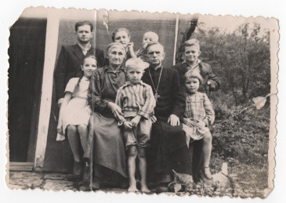

# Олена Папп #

Повне ім'я при народженні: Олена Орестівна Папп.

Народилася 1896-01-02 в селі Верхомля Велика (пол. Wierchomla Wielka), померла 1983-07-07 в місті Самбір. Могила знаходиться в Самборі.

## Фото ##

## Освіта ##

TBA

## Робота ##

TBA

## Шлюб та діти ##

Одружилася з [Омеляном Чайківським](Омелян%20Чайківський.md), змінила прізвище на "Чайківська". Мали дев'ять дітей:

- Ромко і Дарія померли в дитячому віці під час епідемії
- Володимир або Влодек (1917). Після переселення жив в Самборі
- Степан (1921). Вчився на вчителя, під час війни допомагав будувати шпиталь в лісі для УПА, жив в Самборі. [Фото 2](../photos/photo_002.md).
- Зофія (1923). Була зв'язковою УПА
- Ярослав або Славко (1926-12-04). [Фото 5](../photos/photo_005.md),
- Антін або Тосько (1928-11-18). [Фото 9](../photos/photo_009.md),
- [Дарія](Дарія%20Чайківська.md) (1932 - 2020)
- Марія (1936/1937 - 2014). Працювала вчителькою в Україні і Польщі, після заміжжя змінила прізвище на "Сребняк", жила в Польщі

## Інша інформація ##

В 1946 році була примусово переселена разом з сім'єю з Польщі (село Рябе) в Україну (село Мельниця-Подільська).

## Причина смерті ##

TBA

## Джерела інформації та документи ##

Більшість інформації отримано з сторінки чоловіка у вікіпедії та останньої книги про нього (виданої в 2016 році).

## Уточнити та додати ##

- уточнити дату шлюбу (+джерела)
- витяги з реєстру актів цивільного стану
- фото особи та могили
