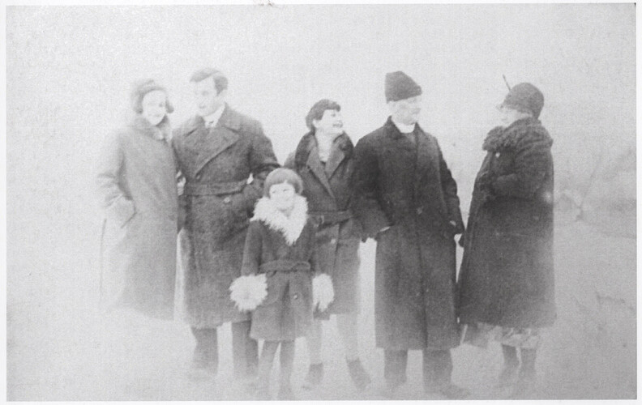

# Омелян Чайківський #

Повне ім'я при народженні - Омелян Чайківський, після Другої світової війни - Чайківський Омелян Володимирович. Варіанти імені (в шематизмі):

- Емиліянь Чайковскій
- Емиліян Чайковский
- Омелянь Чайковскій
- Омелян Чайковський

Народився 1889-10-21 в селі [Явірник](https://uk.wikipedia.org/wiki/Явірник_(Сяноцький_повіт)) (пол. Jawornik), помер 1965-08-25 в місті [Самбір](https://uk.wikipedia.org/wiki/Самбір) (у віці 75 років). Могила знаходиться в Самборі.

Батьки - [Володимир Чайківський](Володимир%20Чайківський.md) та Софія Котис.

## Фото ##

## Освіта та робота ##

Навчання:

- Перемишльська чоловіча гімназія (1909)
- Львівська семінарія (1910-1913)
- Перемишльська семінарія (1913-1914)

Став дияконом 1915-11-28 (перший ступінь), священником 1915-12-05 (другий ступінь).

Праця:

- 1915-1918 - капелан (Перша світова війна, австро-угорська армія, італійський фронт)
- 1918-1926 - адміністратор [Явірець](https://uk.wikipedia.org/wiki/Явірець) (пол. Jaworzec)
- 1926-1944 - священник [Яблінки](https://uk.wikipedia.org/wiki/Яблінки) (пол. Jabłonki)
- 1944-1946 - адміністратор [Рябе](https://uk.wikipedia.org/wiki/Рябе_(Ліський_повіт)) (пол. Rabe)
- 1946-1952 - [Устя](https://uk.wikipedia.org/wiki/Устя_(Чортківський_район))
- 1952-1954 - [Вощанці](https://uk.wikipedia.org/wiki/Вощанці)
- 1954-1959 - [Устя](https://uk.wikipedia.org/wiki/Устя_(Чортківський_район))
- 1959-1962 - [Вовківці/Дністрове](https://uk.wikipedia.org/wiki/Дністрове)

## Шлюб та діти ##

Приблизно в 1915-1917 роках одружився з [Оленою Папп](Олена%20Папп.md). Мали дев'ять дітей (інформація на сторінці дружини).

## Інша інформація ##

Метрична книга села Явірник відсутня в архівах, можливо збереглася в USC гміни Команча (аналог українського відділу РАЦСу), можливо не збереглася взагалі (вони ще не відповіли на моє звернення). Інформація про дату та місце народження (а також про батьків) є в списках духовенства та книгах.

У 1919-1920 роках був заарештований польською владою. В газеті [Свобода](https://uk.wikipedia.org/wiki/Свобода_(газета_в_США)) ([1921 рік, 169 випуск, сторінка 3](https://archive.svoboda-news.com/wp-content/uploads/Svoboda-1921-169.pdf)) є стаття про події тих років.

В 1946 році був депортований разом з сім'єю з Польщі (село Рябе) в Україну (село Устя). Під час депортації був важко побитий польськими солдатами. Частина дітей зійшла (=втекла) з поїзда в Самборі (вони думали, що їх везуть в Сибір). Список депортованих людей, який є в архіві, складався після прибуття до кінцевої станції, він тої частини родини, яка зійшла в Самборі, не містить.

В Усті зазнавав переслідувань від голови місцевої сільради (згідно зі свідченням доньки Дарії, траплялося, що голова під час служби Божої заходив у шапці до церкви й пропонував священикові цигарку).

На старість переїхав разом з дружиною жити до синів в Самбір.

Існував ще інший священник Омелян Чайківський, 1818-1852, працював в тій же єпархії.

## Джерела інформації ##

- Спогади Лева Твердохліба записані в 2024 році (мій тато, його внук)
- Сторінка Омеляна Чайківського у Вікіпедії: https://uk.wikipedia.org/wiki/Чайківський_Омелян_Володимирович
- Шематизм Перемиської єпархії (перша згадка в 1911 році, остання згадка в 1939 році)
- Дмитро Блажейовський - Історичний шематизм Перемиської Єпархії (1828-1939) - 1995
- Богдан Прах - Духовенство Перемиської Єпархії. Том 1 - 2015
- Владислав Сердюк - Династії галицьких священиків Чайківських і Паппів - 2016
- [Довідка з архіву про переселення родини Омеляна Чайківського](https://drive.google.com/file/d/1H4QRI9l3SQxyHny8GRmrl44d3FeVeWrp/view) (ДАЛО, фонд Р-3229, опис 9, справи 9 та 18)
- [Списки духовенства Перемишльської Єпархії / Wykazy jereji lit. Ch, Cz, C, Sz](https://www.szukajwarchiwach.gov.pl/jednostka/-/jednostka/29097944) (Archiwum Państwowe w Przemyślu, справа 56/142/0/3/183supl)
  - запис про Омеляна Чайківського (скан 77) 

## Уточнити та додати ##

- Статус метричної книги села Явірник в USC гміни Команча 
- Витяг з реєстру актів цивільного стану (смерть)
- Фото могили
