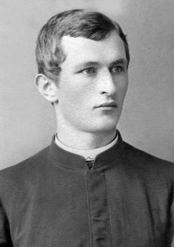

# Орест Папп #

Повне ім'я при народженні - Орест Папп. Варіанти імені (в шематизмі):

- Оресть Паппь
- Orestes Papp (лат.)
- Orest Papp (англ.)

Народився 1866-08-01 в селі [Березець](https://uk.wikipedia.org/wiki/Березець) (пол. Brzeziec), помер 1941-07-13 в селі [Новосілки Опарські](https://uk.wikipedia.org/wiki/Новосілки-Опарські) (у віці 74 років).

Батьки - [Лев Папп](Лев%20Папп.md) та Олімпія Гинилевич.

## Фото ##

## Освіта та робота ##

Навчання:

- Перемишльська гімназія (1886)
- Львівська семінарія (1889-1891)
- Перемишльська семінарія (1892)

Став дияконом 1892-11-07 (перший ступінь), священником 1892-11-20 (другий ступінь).

Праця:

- 1892-1895 - асистент [Старий Самбір](https://uk.wikipedia.org/wiki/Старий_Самбір) (пол. Staremiasto)
- 1895-1905 - кооператор [Твіржа](https://uk.wikipedia.org/wiki/Твіржа) (пол. Twierdza)
- 1905-1908 - священник [Новосілки](https://uk.wikipedia.org/wiki/Великі_Новосілки) (пол. Nowosiółki Wielkie)
- 1908-1909 - священник [Маккіспорт](https://en.wikipedia.org/wiki/McKeesport,_Pennsylvania) (англ. McKeesport)
- 1910-1910 - асистент [Добрівляни](https://uk.wikipedia.org/wiki/Добрівляни_(Дрогобицький_район)) (пол. Dobrowlany)
- 1910-1910 - адміністратор [Селиська](https://uk.wikipedia.org/wiki/Оселя_(село)) (пол. Siedliska)
- 1910-1911 - адміністратор [Малковичі](https://uk.wikipedia.org/wiki/Малковичі_(Підкарпатське_воєводство)) (пол. Małkowice)
- 1911-1913 - адміністратор [Куличків](https://uk.wikipedia.org/wiki/Куличків) (пол. Kuliczków)
- 1913-1936 - адміністратор/священник [Верхомля Велика](https://uk.wikipedia.org/wiki/Верхомля_Велика) (пол. Wierchomla Wielka)

## Шлюб та діти ##

Приблизно в 1880-х роках одружився з [Софією Липською](Софія%20Липська.md). Мали щонайменше 7 дітей (інформація на сторінці дружини).

## Інша інформація ##

Метрична книга села Березець за 1866 рік не збереглася. Інформація про дату та місце народження є в списках духовенства та книгах. Інформація про батьків є в списках духовенства, книгах та записах про народження дітей.

Під час проживання в селі Твіржа жив в будинку #120.

В газеті [Свобода](https://uk.wikipedia.org/wiki/Свобода_(газета_в_США)) ([1909 рік, 11 випуск, сторінка 3](https://archive.svoboda-news.com/wp-content/uploads/Svoboda-1909-11.pdf)) є його звернення до парафіян греко-католицької церкви в місті McKeesport (церква мала приблизно 6 тисяч доларів боргу перед банком, 200 тисяч доларів в цінах 2025 року, він просив про більші пожертви).

Працював в США протягом 1908-1909 років, збереглися списки пасажирів корабля з детальною інформацією про нього (див. нижче).

Запатентував декілька винаходів в США в 1909-1911 роках (non-refillable bottle, [US940049](https://drive.google.com/file/d/10PkpNT7-PrAX8SOFBVJnlMQcV9CdyU3Z/view) та [US994601](https://drive.google.com/file/d/195bomR0Urg7YXkRXRf2arBw7G5wbpJH0/view).

## Джерела інформації ##

- Шематизм Перемиської єпархії (перша згадка в 1889 році, остання згадка в 1934 році)
- Шематизм Апостольської Адміністрації Лемківщини (1936)
- Дмитро Блажейовський - Історичний шематизм Перемиської Єпархії (1828-1939) - 1995
- Богдан Прах - Духовенство Перемиської Єпархії. Том 1 - 2015
- Владислав Сердюк - Династії галицьких священиків Чайківських і Паппів - 2016
- [подорож до США (1908 рік, Орест Папп)](../docs/doc_003.md)
- [Списки духовенства Перемишльської Єпархії / Wykazy jereji lit. O, P, R](https://www.szukajwarchiwach.gov.pl/en/jednostka/-/jednostka/29097938) (Archiwum Państwowe w Przemyślu, справа 56/142/0/3/180supl)
  - запис про Ореста Паппа (скан 48) 

## Уточнити та додати ##

- Фото могили
