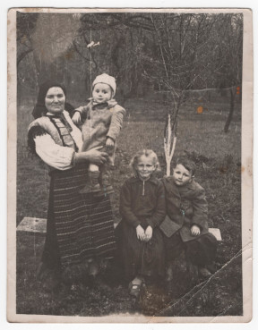

# Юстина Роґа #

Повне ім'я при народженні - Юстина Роґа, після одруження - Юстина Твердохліб, після Другої світової війни - Твердохліб Юстина Дмитрівна.

Народилася 1896-02-10 або 1902-07-19 в селі [Устя](https://uk.wikipedia.org/wiki/Устя_(Чортківський_район)), померла 1971-11-02 там же (у віці 69 або 75 років). Могила знаходиться в Усті.

Батьки - [Дмитро Роджак](Дмитро%20Роджак.md) та [Марія Роджак](Марія%20Роджак.md).

## Фото ##

## Освіта та робота ##

Працювала на землі (рільник).

## Шлюб та діти ##

1922-11-14 одружилася з [Іллею Твердохлібом](Ілля%20Твердохліб.md). Мали троє дітей:

- Яків
- [Василь](Василь%20Твердохліб.md) (1928-06-01 - 2006-06-12)
- Петро (1931-06-24 - 1957-11). [Фото 44](../photos/photo_044.md)

## Інша інформація ##

Син Яків помер в дитячому віці, син Петро помер від нещасного випадку / опіків.

Прізвище в записі про шлюб (Роґа) відрізняється від прізвища в повторному свідоцтві про народження (Роджак). Причина невідома, нам було відоме тільки прізвище Роджак, але воно дуже рідкісне, практично не згадується в інтернеті чи книгах. В метричній книзі Устя зустрічається переважно прізвище Роґа (записане як "Роfа"). Можливо це були паралельні форми або адаптація до відсутньої букви "ґ" в алфавіті радянських часів.

Дата народження в повторному свідоцтві про народження (1896-02-10) відрізняється від дати народження в записі про шлюб (1902-07-19). Причина невідома, але 1902 рік значно більш ймовірний:

- запис про шлюб був зроблений на 30 років раніше від дати видачі повторного свідоцтва про народження
- запис про шлюб був зроблений священником, який там працював протягом 30 років (Ізидор Ганкевич, 1892 - 1936)
- цей священник мав би мати доступ до оригінальної метричної книги з записами про народження, яка зберігалася в церкві
- більше того, це був той самий священник, який мав би робити початковий запис про народження (або його помічник)

На час видачі повторного свідоцтва їй якраз "виповнилося" 55 років, можливо інша дата народження пов'язана з пенсійним віком або необхідністю працювати в колгоспі до певного віку.

Причина смерті - нещасний випадок (завалився дах будинку через пожежу коло комина).

## Джерела інформації ##

- Спогади Лева Твердохліба записані в 2024 році (мій тато, її внук)
- [Метрична книга церкви c. Устя (копія), реєстрація народження, 1877-1937](https://drive.google.com/file/d/18K9VZ_zkVMZE2NGHTswQ3GG8TfCesbJy/view) (ДАТО, фонд 487, опис 1, справа 735)
  - запис про народження сина Василя (скан 120)
  - запис про народження сина Петра (скан 137)
- [Метрична книга церков с. Нивра, Окопи, Трубчин, Устя (копія), реєстрація шлюбу, 1877-1943]() (ДАТО, фонд Р-3572, опис 2, справа 162)
  - запис про шлюб (скан 192)
- [Фото свідоцтва про народження](https://drive.google.com/file/d/104Cayzs4Skr4kon-scQowLEGoMnJ15Kn/view) (відновлене, видане в 1952 році)

## Уточнити та додати ##

- Витяг з реєстру актів цивільного стану (смерть)
