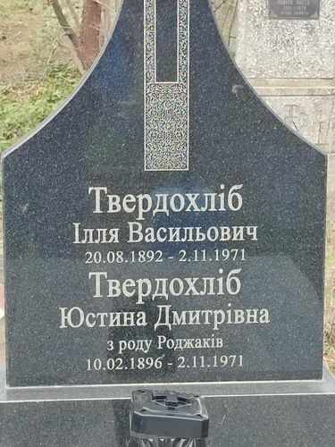

# Юстина Роджак #

Повне ім'я при народженні: Юстина Дмитрівна Роджак.

Народилася 1896-02-10 в селі Устя, померла 1971-11-02 році в селі Устя (у віці 75 років). Могила знаходиться в Усті.

## Фото ##

## Освіта ##

TBA

## Робота ##

TBA

## Шлюб та діти ##

Вийшла заміж за [Іллю Твердохліба](Ілля%20Твердохліб.md) (церковний шлюб). Мали троє дітей:

- Яків Твердохліб (помер в дитячому віці, могила в Усті)
- [Василь Твердохліб](Василь%20Твердохліб.md) (1928-06-01 - 2006-06-12)
- Петро Твердохліб (1931-08 - 1957-11, помер від нещасного випадку / опіків, могила в Усті). [Фото 44](../photos/photo_044.md)

## Причина смерті ##

Померла разом з чоловіком в Усті від нещасного випадку (завалився дах будинку через пожежу коло комина).

## Джерела інформації та документи ##

Більшість інформації записано в 2024 році зі слів її внука Лева Твердохліба (мого тата). Дати народження і смерті вказані на могилі.

Документи:

- [фото свідоцтва про народження](https://drive.google.com/file/d/104Cayzs4Skr4kon-scQowLEGoMnJ15Kn/view) (відновлене, видане в 1952 році)

## Уточнити та додати ##

- точна дата шлюбу (+джерело)
- точні дати народження дітей (+джерела)
- витяги з реєстру актів цивільного стану (одруження, смерть)
- фото могили
