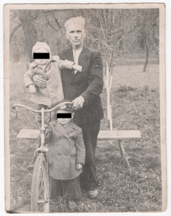

# Фото #

Краща якість: [600 dpi](https://drive.google.com/file/d/1JDe7_NbM2IRkq3kWX7O-fOG_UECSWr0T/view), [2400 dpi](https://drive.google.com/file/d/1M03K9IVqisUe8AHSYeCjYpmAMO-OJ2WU/view).

# Опис #

Ілля Твердохліб з внуками, знизу ОСОБА_1, зверху ОСОБА_2. Записано зі слів тата.

# Дата фото та сканування #

Фото зроблено приблизно в 1961-1962 році (ОСОБА_1 на вигляд 3-4 роки). Відскановано 2025-03-14.

# Копірайт та персональні дані #

Фото з сімейного архіву, автор невідомий. На практиці можна вважати, що фото в суспільному надбанні і може використовуватися без обмежень (малоймовірно, що хтось може підтвердити свої права на нього). Всі люди на фото або вже померли або мають приховані імена та очі.
