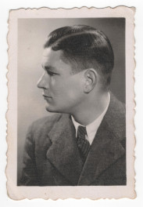

# Фото 2 #

Краща якість: [600 dpi](https://drive.google.com/file/d/1TqkeNcvgWwfkuUqMnDf43gEbSHjmCHD7/view), [2400 dpi](https://drive.google.com/file/d/1fSutaQ64J_Vop8qDllCaHdroiS2GCZIP/view).

# Опис #

Ймовірно Степан Чайківський (син Омеляна Чайківського). Записано зі слів тата.

# Дата фото та сканування #

Невідома дата. Відскановано 2025-03-14.

# Копірайт та персональні дані #

Фото з сімейного архіву, автор невідомий. На практиці можна вважати, що фото в суспільному надбанні і може використовуватися без обмежень (малоймовірно, що хтось може підтвердити свої права на нього). Всі люди на фото або вже померли або мають приховані імена та очі.
