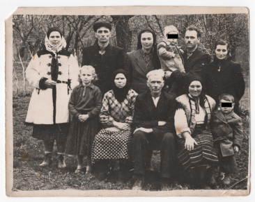

# Фото 10 #

Краща якість: [600 dpi](https://drive.google.com/file/d/1aLnwi9drNxb_kk43ES9GC2TLPSvgTPGI/view), [2400 dpi](https://drive.google.com/file/d/1vDXi9OsP8M2XT_07Rxw5Pu49dbRE3-Dm/view).

# Опис #

Верхній ряд, зліва направо:
- Марія Роджак/Гуменюк (дочка Ганни Твердохліб/Роджак, племінниця Іллі Твердохліба)
- її чоловік Василь Гуменюк
- Анастасія Горбуль (двоюрідна сестра Юстини Роджак/Твердохліб)
- Василь Твердохліб, тримає на руках ОСОБА_2
- Дарія Чайківська/Твердохліб

Нижній ряд, зліва направо:
- Наталка Костюк (дочка Анастасії Горбуль, троюрідна сестра ОСОБА_1)
- Ганна Твердохліб/Роджак (сестра Іллі Твердохліба, мама Марії Роджак/Гуменюк)
- Ілля Твердохліб
- Юстина Роджак/Твердохліб
- ОСОБА_1

Записано зі слів тата.

# Дата фото та сканування #

Фото зроблено приблизно в 1962-1963 роках (ОСОБА_1 на вигляд 4-5 років). Відскановано 2025-03-14.

# Копірайт та персональні дані #

Фото з сімейного архіву, автор невідомий. На практиці можна вважати, що фото в суспільному надбанні і може використовуватися без обмежень (малоймовірно, що хтось може підтвердити свої права на нього). Всі люди на фото або вже померли або мають приховані імена та очі.
