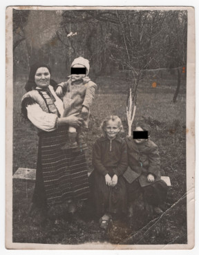

# Фото 12 #

Краща якість: [600 dpi](https://drive.google.com/file/d/1P3d_WoQ7c15klFFzezHwDy4eA_iAizqz/view), [2400 dpi](https://drive.google.com/file/d/11a6P1aJTGXNDJG8Yh7DmVy7AjSTbYP84/view).

# Опис #

Зліва направо:
- Юстина Роджак/Твердохліб, в неї на руках ОСОБА_2
- Наталка Костюк (дочка сестри Юстини Роджак/Твердохліб, двоюрідна сестра ОСОБА_1)
- ОСОБА_1

Записано зі слів тата.

# Дата фото та сканування #

Фото зроблено приблизно в 1959-1960 роках (ОСОБА_2 на вигляд 2 роки). Відскановано 2025-03-14.

# Копірайт та персональні дані #

Фото з сімейного архіву, автор невідомий. На практиці можна вважати, що фото в суспільному надбанні і може використовуватися без обмежень (малоймовірно, що хтось може підтвердити свої права на нього). Всі люди на фото або вже померли або мають приховані імена та очі.
