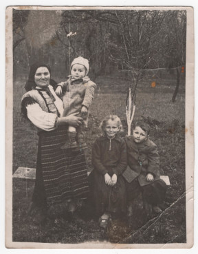

# Фото 12 #

Краща якість: [600 dpi](https://drive.google.com/file/d/1YSKrkYpGSKBMyPe3CXgOzb9GHQTyJsGz/view), [2400 dpi](https://drive.google.com/file/d/1m01-DS0UwloZzrUDr3xsKee_HMTqv6MW/view).

# Опис #

Зліва направо:
- Юстина Роджак/Твердохліб, в неї на руках Петро Твердохліб
- Наталка Костюк (дочка Анастасії Горбуль, троюрідна сестра Лева Твердохліба)
- Лев Твердохліб

Записано зі слів тата.

# Дата фото та сканування #

Фото зроблено приблизно в 1959-1960 роках (Петру Твердохлібу на вигляд 2 роки). Відскановано 2025-03-14.

# Копірайт та персональні дані #

Фото з сімейного архіву, автор невідомий. На практиці можна вважати, що фото в суспільному надбанні і може використовуватися без обмежень (малоймовірно, що хтось може підтвердити свої права на нього). Лев та Петро Твердохліби дали усну згоду на публікацію їхніх старих дитячих фото та імен.
