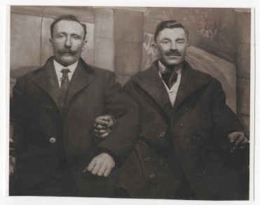

# Фото 19 #

Краща якість: [600 dpi](https://drive.google.com/file/d/1AVfswecV_VC0nlMbCFiiuSCEmnrBkFfg/view), [2400 dpi](https://drive.google.com/file/d/1U-X-aS9JEyfX88h_hWh17GW8-ZpfIvws/view).

# Опис #

Зліва Лазар Романів, справа Василь Паньків (тато "Марці Василькової"). Записано зі слів мами.

# Дата фото та сканування #

Невідома дата. Часткова копія старішого фото. Відскановано 2025-03-14.

# Копірайт та персональні дані #

Фото з сімейного архіву, автор невідомий. На практиці можна вважати, що фото в суспільному надбанні і може використовуватися без обмежень (малоймовірно, що хтось може підтвердити свої права на нього). Всі люди на фото або вже померли або мають приховані імена та очі.
