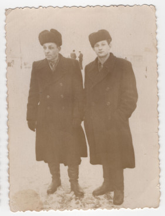

# Фото 23 #

Краща якість: [600 dpi](https://drive.google.com/file/d/1WxRXcUhEkW895DkhUuz0th-LY56z8L7M/view), [2400 dpi](https://drive.google.com/file/d/1_H2zSxsGUiRe5JOUJGfDqogswpWkdMwi/view).

# Опис #

Зліва Федір Булавинець (брат Миколи Булавинця), справа невідомий чоловік (його друг). Записано зі слів мами.

# Дата фото та сканування #

Фото зроблено приблизно в 1950-тих роках. Відскановано 2025-03-14.

# Копірайт та персональні дані #

Фото з сімейного архіву, автор невідомий. На практиці можна вважати, що фото в суспільному надбанні і може використовуватися без обмежень (малоймовірно, що хтось може підтвердити свої права на нього). Всі люди на фото або вже померли або мають приховані імена та очі.
