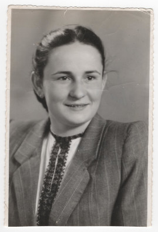

# Фото 25 #

Краща якість: [600 dpi](https://drive.google.com/file/d/12xHZRN2eJP1eO8tYaaZKQgwYYAp8tYzK/view), [2400 dpi](https://drive.google.com/file/d/14vewspiD4XMaid-ftFGIARnNQdzGj11h/view).

# Опис #

Анна Булавинець (дочка Марії Романів/Булавинець). Записано зі слів мами.

# Дата фото та сканування #

Фото зроблено в 1957 році (вказано на звороті). Відскановано 2025-03-14.

# Копірайт та персональні дані #

Фото з сімейного архіву, автор невідомий. На практиці можна вважати, що фото в суспільному надбанні і може використовуватися без обмежень (малоймовірно, що хтось може підтвердити свої права на нього). Всі люди на фото або вже померли або мають приховані імена та очі.
