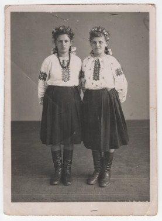

# Фото 26 #

Краща якість: [600 dpi](https://drive.google.com/file/d/1JcQjAeqZRYiuJiOPR-Fxh4L02TSp9vbX/view), [2400 dpi](https://drive.google.com/file/d/1QEX4B-GsoDJYNZphMuuMu5qHo6INP9hG/view).

# Опис #

Зліва Анна Булавинець (дочка Марії Романів/Булавинець), справа невідома жінка. Записано зі слів мами.

# Дата фото та сканування #

Невідома дата. Відскановано 2025-03-14.

# Копірайт та персональні дані #

Фото з сімейного архіву, автор невідомий. На практиці можна вважати, що фото в суспільному надбанні і може використовуватися без обмежень (малоймовірно, що хтось може підтвердити свої права на нього). Всі люди на фото або вже померли або мають приховані імена та очі.
