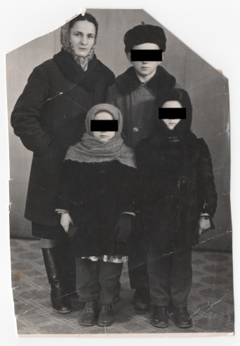

# Фото 28 #

Краща якість: [600 dpi](https://drive.google.com/file/d/1e8GWZRNtBRtEH-9Mt_GjZnhZq4d4ghcH/view), [2400 dpi](https://drive.google.com/file/d/1tGMwalUxAgI-UvRpa4sv20V2UspbSmR2/view).

# Опис #

Верхній ряд: Анна Булавинець (дочка Марії Романів/Булавинець), невідомий чоловік

Нижній ряд: ОСОБА_3, невідомий чоловік

Записано зі слів мами.

# Дата фото та сканування #

Невідома дата. Відскановано 2025-03-14.

# Копірайт та персональні дані #

Фото з сімейного архіву, автор невідомий. На практиці можна вважати, що фото в суспільному надбанні і може використовуватися без обмежень (малоймовірно, що хтось може підтвердити свої права на нього). Всі люди на фото або вже померли або мають приховані імена та очі.
