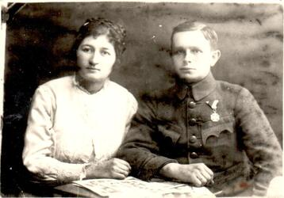

# Фото 32 #

# Опис #

Олена Папп та Омелян Чайківський

# Дата фото та сканування #

Невідома дата (під час або після Першої світової війни, Омелян у військовій формі). Збережено з інтернету 2025-09-08.

# Копірайт та персональні дані #

Фото є в книзі Владислав Сердюк - Династії галицьких священиків Чайківських і Паппів - 2016 (с. 13). Також на сторінці села Яблінки в фейсбуці: https://www.facebook.com/photo?fbid=2072879889635818. Джерело не вказане ні там, ні там. Зважаючи на те, що фото зроблене більше століття тому, на практиці можна вважати, що фото в суспільному надбанні і може використовуватися без обмежень (малоймовірно, що хтось може підтвердити свої права на нього). Всі люди на фото або вже померли або мають приховані імена та очі.
