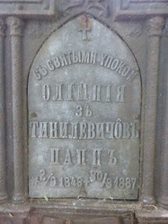

# Фото 33 #

# Опис #

Могила Олімпії Гинилевич (дружина Лева Папп) в селі Берегове.

# Дата фото та сканування #

2024-07-08. Збережено з інтернету 2025-09-06.

# Копірайт та персональні дані #

Фото є на сторінці часопису "Рідний край - Мостищина" в фейсбуці: https://www.facebook.com/groups/171202093027399/permalink/2897902300357351/. Автор - Іван Білас. В мене немає дозволу на використання цього фото, так що тут тільки маленька версія для попереднього перегляду.
