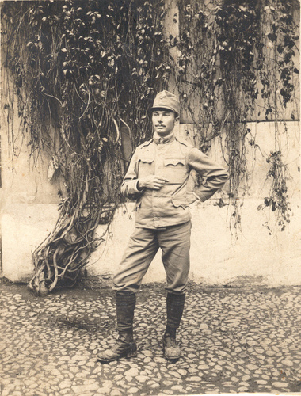

# Фото 34 #

# Опис #

Степан Бреславський (брат Йосипа Бреславського).

# Дата фото та сканування #

Невідома дата (під час або після Першої світової війни, Степан у військовій формі). Збережено з myheritage 2025-05-17.

# Копірайт та персональні дані #

Фото є в декількох сімейних деревах на сайті myheritage, початкове джерело невідоме. Зважаючи на те, що фото зроблене більше століття тому, на практиці можна вважати, що фото в суспільному надбанні і може використовуватися без обмежень (малоймовірно, що хтось може підтвердити свої права на нього). Всі люди на фото або вже померли або мають приховані імена та очі.
