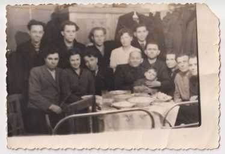

# Фото 36 #

# Опис #

Верхній ряд, перший зліва - Федір Булавинець (брат Миколи Булавинця).

Нижній ряд, з дитиною - Василь Коваль з дружиною, обоє з Кропивника.

Під час відбування покарання у Воркуті. Записано зі слів мами.

# Дата фото та сканування #

Невідома дата (приблизно 1945-1955 роки). Відскановано 2024-12-12.

# Копірайт та персональні дані #

Фото з сімейного архіву, автор невідомий. На практиці можна вважати, що фото в суспільному надбанні і може використовуватися без обмежень (малоймовірно, що хтось може підтвердити свої права на нього). Всі люди на фото або вже померли або мають приховані імена та очі.
