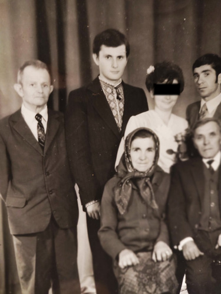

# Фото 40 #

# Опис #

Верхній ряд:
- Володимир Чайківський (син Омеляна Чайківського)
- Петро Твердохліб (син Василя Твердохліба)
- ОСОБА_4, її чоловік Василь

Нижній ряд:
- батьки чоловіка ОСОБИ_4

Весільне фото, записано зі слів батька.

# Дата фото та сканування #

Невідома дата. Перефотографовано мобільним телефоном 2025-04.

# Копірайт та персональні дані #

Фото з сімейного архіву, автор невідомий. На практиці можна вважати, що фото в суспільному надбанні і може використовуватися без обмежень (малоймовірно, що хтось може підтвердити свої права на нього). Всі люди на фото або вже померли або мають приховані імена та очі (Петро Твердохліб дав усну згоду на публікацію його старих дитячих фото та ім'я).
